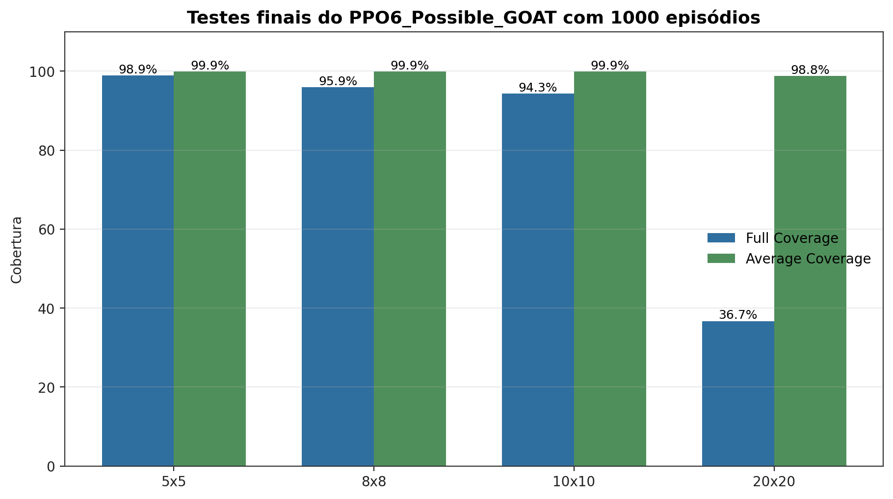
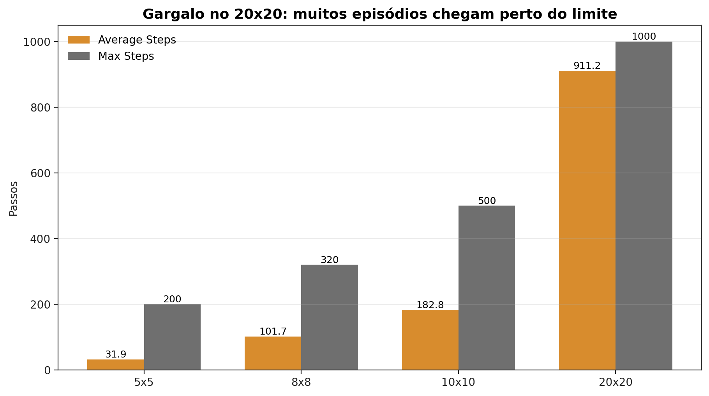
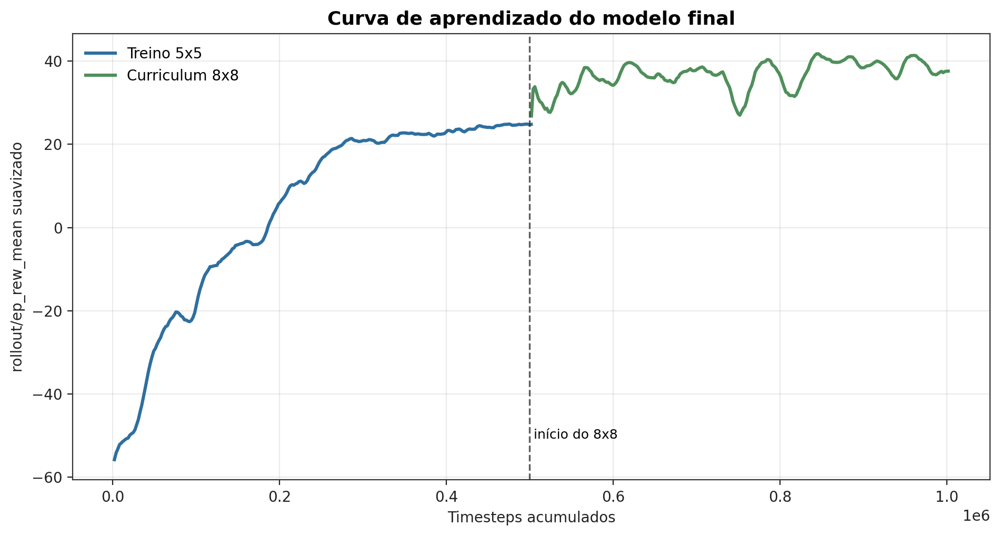
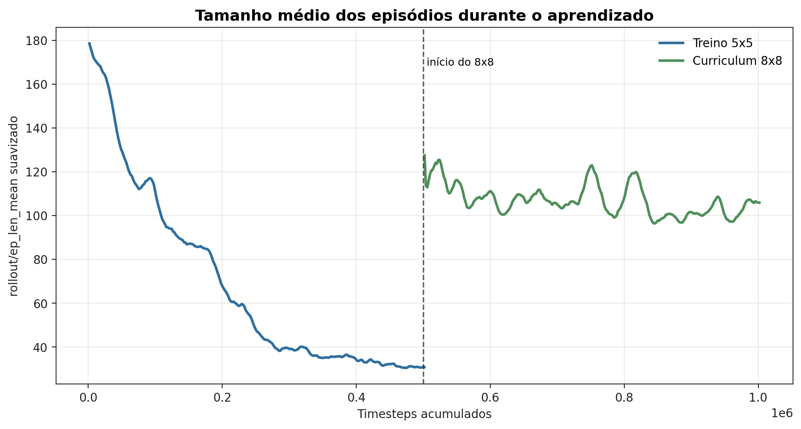
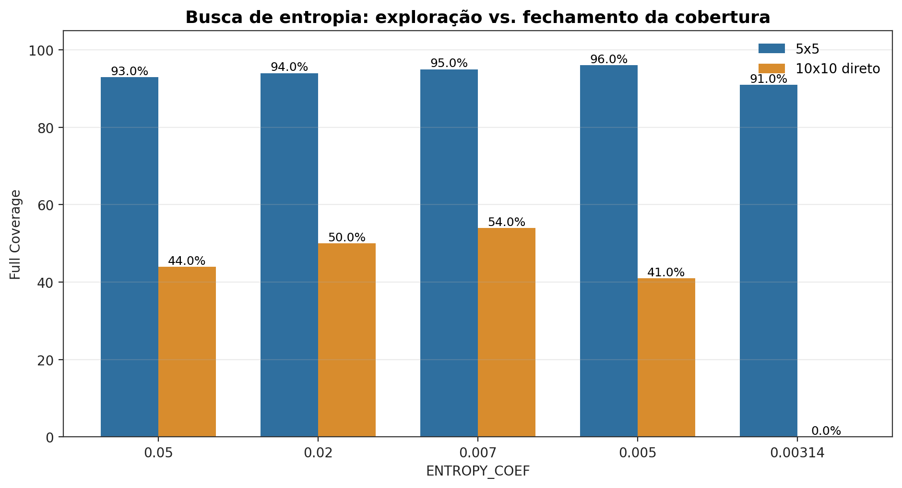
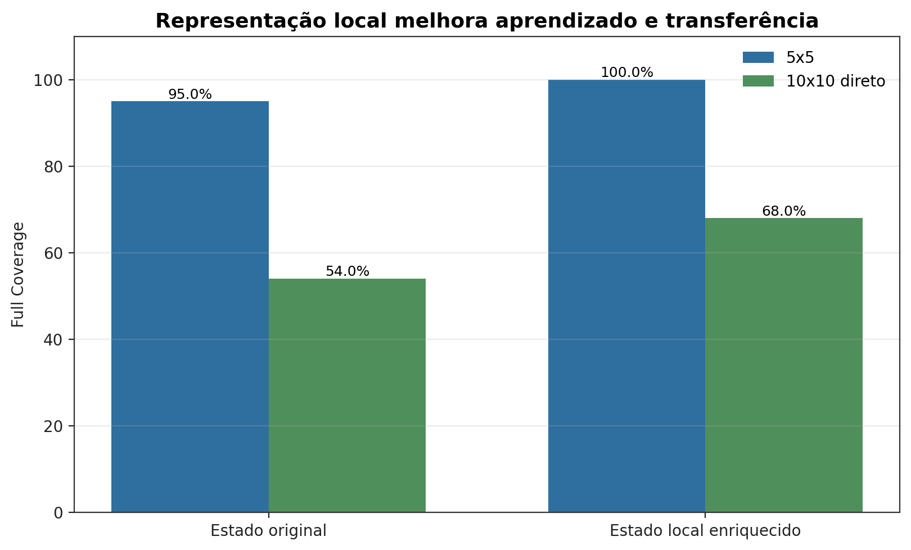
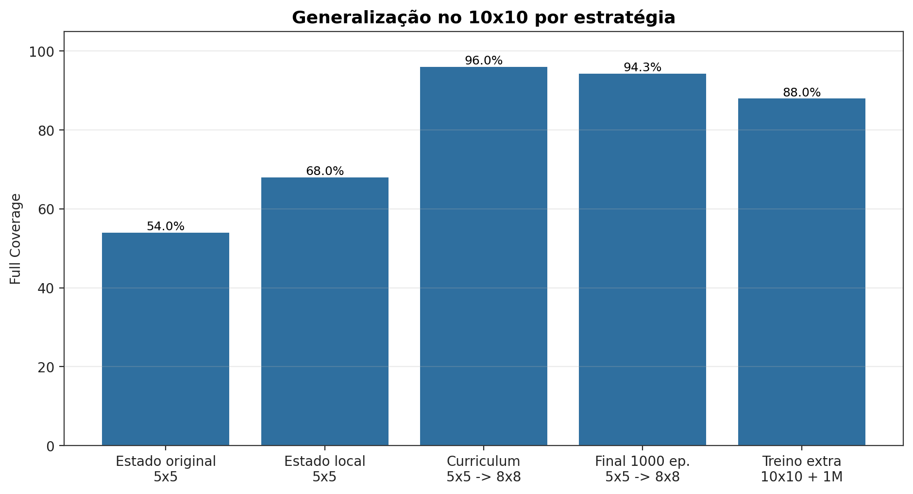
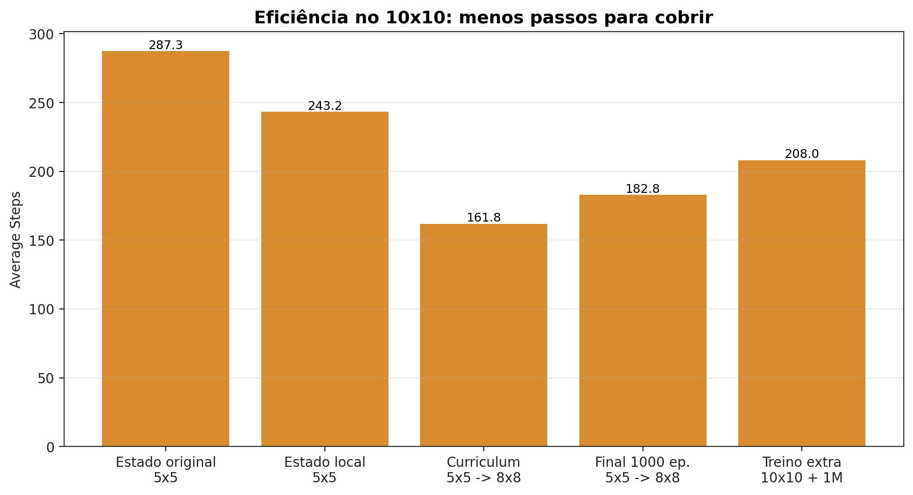
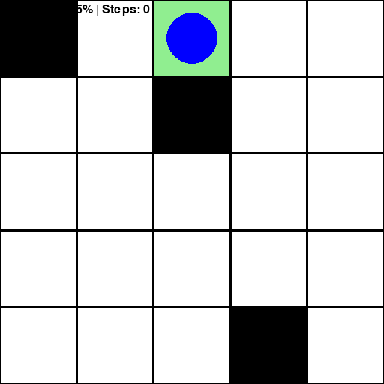
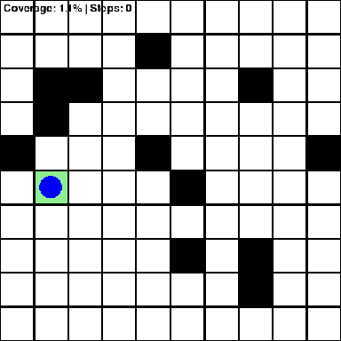

# APS8 — Coverage Path Planning com Reinforcement Learning

Este repositório implementa um ambiente `GridWorld` para **Coverage Path Planning (CPP)** com obstáculos e observação parcial. O agente deve visitar todas as células livres acessíveis usando PPO da Stable Baselines3.

O relatório final está em:

[`RELATOME.md`](RELATOME.md)

Ele documenta a evolução da solução, os testes finais de `1000` episódios, os gráficos e a análise de generalização para `10x10` e `20x20`.

## Instalação

```powershell
python -m venv venv
.\venv\Scripts\activate
pip install -r requirements.txt
```

## Modelo final recomendado

Use:

`PPO6_Possible_GOAT`

Arquivo:

`data/PPO6_Possible_GOAT.zip`

Esse modelo foi treinado com:

- PPO + `MultiInputPolicy`;
- observação parcial;
- estado local enriquecido a partir do `neighbors 3x3`;
- `ENTROPY_COEF = 0.007`;
- curriculum `5x5 -> 8x8`;
- `500.000` timesteps no `5x5`;
- `500.000` timesteps no `8x8`;
- sem treino direto no `10x10`.

## Parâmetros principais

| Ambiente | Comando parcial | Dimensão | Obstáculos | Max steps |
|---|---|---:|---:|---:|
| `5x5` | `test 5 3 200` | `5` | `3` | `200` |
| `8x8` | `test 8 8 320` | `8` | `8` | `320` |
| `10x10` | `test 10 12 500` | `10` | `12` | `500` |
| `20x20` | `test 20 48 1000` | `20` | `48` | `1000` |

O `8x8` é usado como etapa intermediária de curriculum, não como requisito principal do enunciado.

## Como testar o modelo final

Ao rodar cada comando, informe `PPO6_Possible_GOAT` quando o script pedir o nome do modelo.

```powershell
.\venv\Scripts\python.exe train_grid_world_cpp.py test 5 3 200
.\venv\Scripts\python.exe train_grid_world_cpp.py test 8 8 320
.\venv\Scripts\python.exe train_grid_world_cpp.py test 10 12 500
.\venv\Scripts\python.exe train_grid_world_cpp.py test 20 48 1000
```

Os logs das últimas avaliações estão em `results/test_PPO6_Possible_GOAT_*.log`.

## Resultados finais sem 20x20. 

| Modelo | Teste | Episódios | Full Coverage | Average Coverage | Average Steps |
|---|---|---:|---:|---:|---:|
| `PPO6_Possible_GOAT` | `5x5` | `1000` | `98.90%` | `99.87%` | `31.9` |
| `PPO6_Possible_GOAT` | `8x8` | `1000` | `95.90%` | `99.86%` | `101.7` |
| `PPO6_Possible_GOAT` | `10x10` | `1000` | `94.30%` | `99.86%` | `182.8` |
| `PPO6_Possible_GOAT` | `20x20` | `1000` | `36.70%` | `98.76%` | `911.2` |

O resultado principal da APS é o `10x10`: o modelo treinado só em `5x5 -> 8x8` generalizou fortemente para `10x10` mantendo observação parcial.

****

O `20x20` aparece como extensão: a cobertura média continua alta, mas a taxa de episódios completos cai porque o agente passa a bater perto do limite de passos.

****

## Entretanto, como visto em RelatoME, conseguimos generalizar para o 20x20 >= 90% full coverage também.

## Como treinar

Treino novo:

```powershell
.\venv\Scripts\python.exe train_grid_world_cpp.py train 5 3 200 500000
```

Curriculum a partir de um modelo existente:

```powershell
.\venv\Scripts\python.exe train_grid_world_cpp.py curriculum 8 8 320 500000
```

O script pedirá o nome do modelo inicial salvo em `data/`.

## Como visualizar um episódio

```powershell
.\venv\Scripts\python.exe train_grid_world_cpp.py run 10 12 500
```

Informe `PPO6_Possible_GOAT` quando solicitado.

## Gráficos finais

Os gráficos finais já estão plotados em `Graficos/`. Para regenerar:

```powershell
.\venv\Scripts\python.exe GeraGraficos.py
```

Principais gráficos:

****

****

****

****

****

****

Arquivos de dados:

- `Graficos/dados_01_entropia.csv`
- `Graficos/dados_02_estado_local.csv`
- `Graficos/dados_03_estrategias_10x10.csv`
- `Graficos/dados_04_testes_finais_1000.csv`
- `Graficos/dados_05_curva_aprendizado_modelo_final.csv`

## Observação parcial

O agente não recebe mapa completo, lista global de obstáculos, células restantes globais, caminho ótimo, BFS ou A*.

A observação inclui apenas posição normalizada, `coverage_ratio`, matriz local `3x3` e estatísticas derivadas desse `3x3`. A checagem de conectividade no `reset()` é lógica interna do ambiente e não é retornada ao agente.

## Visualização

Os GIFs abaixo foram gerados com `GeraGifs.py`, carregando o modelo final sem alterar a lógica do ambiente ou da política.

| `5x5` | `10x10` |
|---|---|
|  |  |

# O RELATÓRIO DAS IMPLEMENTAÇÕES ESTÁ EM RELATOME.MD!!!
# O RELATÓRIO DAS IMPLEMENTAÇÕES ESTÁ EM RELATOME.MD!!!

## O imperador reina solitário abaixo do sol