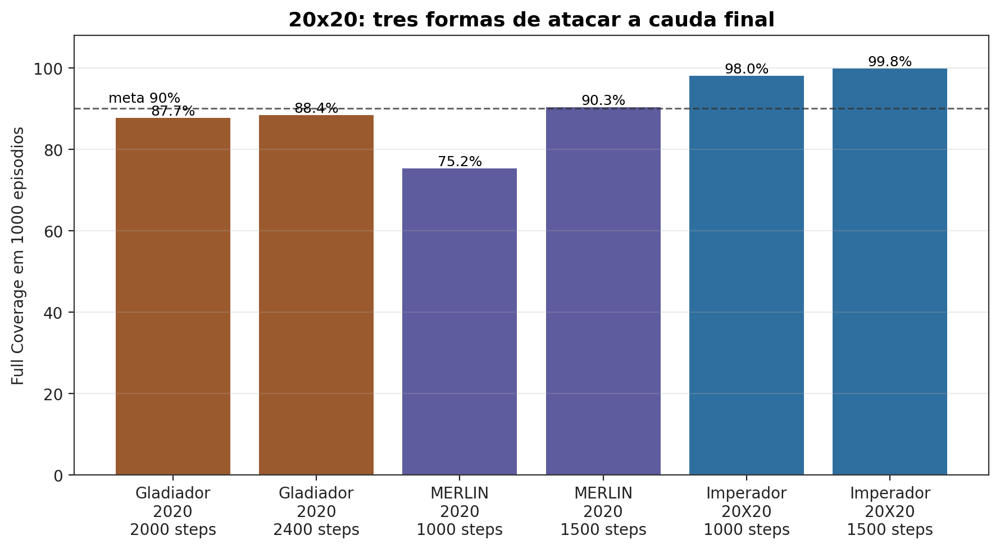
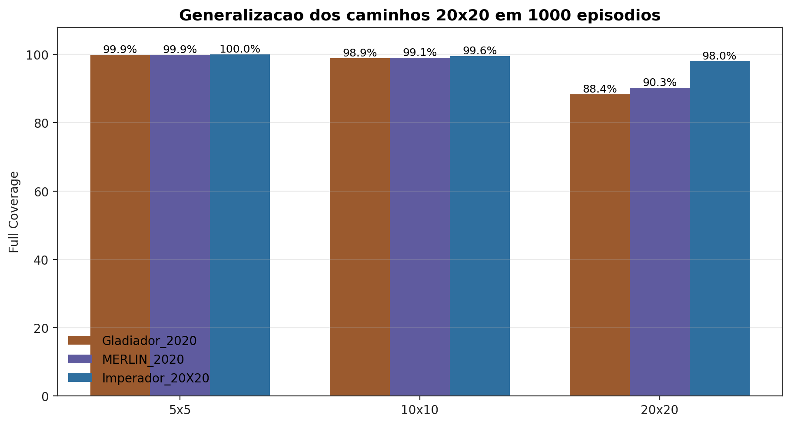
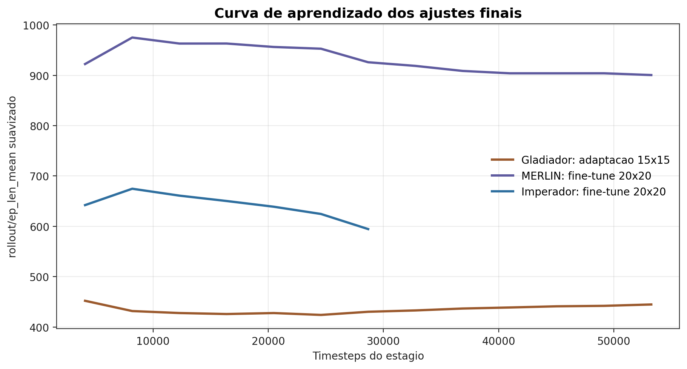
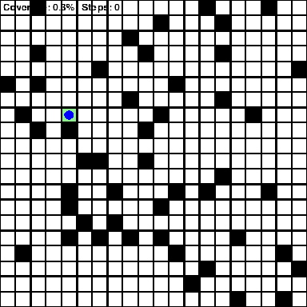
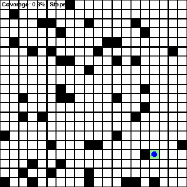
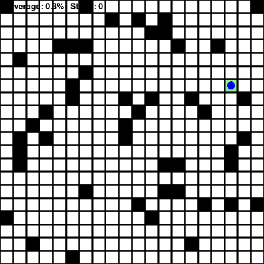
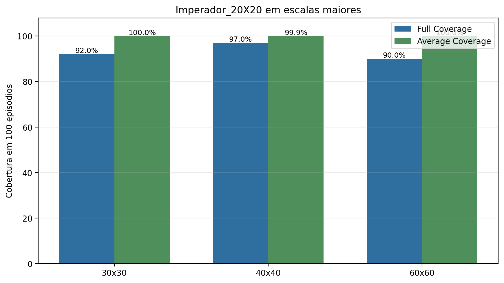
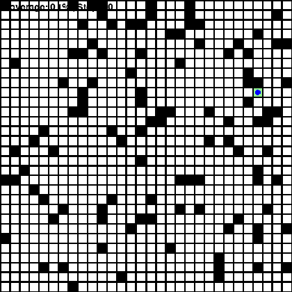
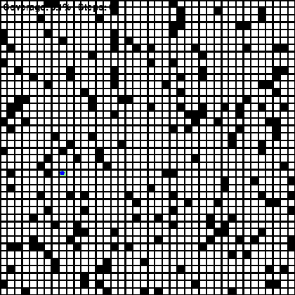
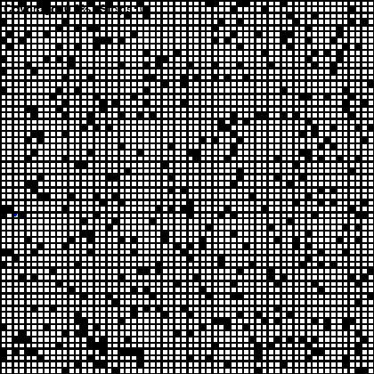

# Relatório — Coverage Path Planning com PPO em GridWorld

## 1. Contextualização

O problema desta APS é **Coverage Path Planning (CPP)** em um `GridWorld`: o agente deve cobrir todas as células livres e acessíveis do mapa, evitando obstáculos, paredes e revisitas desnecessárias.

A restrição central imposta é que o agente opera com **observação parcial**. Ele não recebe o mapa completo. A política decide a partir da posição normalizada, da taxa de cobertura já obtida e de uma vizinhança local `3x3`.

A ideia básica: um agente treinado em `5x5` aprende o ambiente pequeno, mas tende a generalizar mal para `10x10`. A solução final mostra que, com estado local melhorado, mapas possíveis, ajuste de entropia e curriculum `5x5 -> 8x8`, o agente passou a generalizar muito bem para `10x10` sem sequer precisar treinar diretamente nele, também **alcançando questão de 1/3 de full coverage no 20x20 treinando apenas no 5x5 e 8x8**. *isto é, tendo experienciado, no melhor caso, apenas um ambiente mais de 6 vezes menor que o alvo*.

## 2. Baseline e problema observado

Nos resultados iniciais concedidos, o PPO com `MultiInputPolicy` já conseguia aprender parte do `5x5`, mas os resultados ficavam na faixa aproximada de `69/100` a `81/100` episódios com cobertura completa. Ao tentar levar a mesma ideia para `10x10`, a generalização não tinha chance.

A hipótese técnica era que uma política puramente local podia memorizar padrões úteis no `5x5`, mas ainda não tinha sinais suficientes para decidir bem em trajetórias mais longas. Em CPP, o erro aparece principalmente no final do episódio: o agente cobre quase tudo, mas pode revisitar demais e não fechar as últimas células dentro do limite de passos.

## 3. Estratégia geral

A estratégia final foi progressiva:

1. Corrigir a infraestrutura do script para `train`, `test`, `run` e `curriculum` aceitarem argumentos corretamente.
2. Manter PPO com `MultiInputPolicy`, porque a observação do ambiente é um `Dict`.
3. Ajustar `ENTROPY_COEF`, equilibrando exploração e fechamento da cobertura.
4. Corrigir mapas impossíveis/desconectados no `reset()`.
5. Enriquecer o estado apenas com estatísticas locais derivadas do `neighbors 3x3`.
6. Aplicar curriculum learning `5x5 -> 8x8`.
7. Testar generalização para `10x10` e, como extensão, `20x20`.

Resumidamente, o ganho veio de melhorar a formulação do MDP sem violar observação parcial: episódios factíveis, features locais mais informativas e uma transição de dificuldade menos brusca. Além disso, continuamos com a mesma família com MultiInputPolicy e FeedForward.


## 5. Arquitetura da rede

`MultiInputPolicy` foi mantida porque o ambiente retorna uma observação do tipo `Dict`, com as entradas `"agent"` e `"neighbors"`. Essa escolha é coerente com o problema: uma parte da observação é vetorial e a outra é uma matriz local.

No código final do repositório, não há `policy_kwargs` customizado. O PPO usa a arquitetura padrão da `MultiInputPolicy`, com `ENTROPY_COEF = 0.007`.

| Decisão | Configuração final | Intuição |
|---|---|---|
| Algoritmo | PPO | Foi suficiente após corrigir estado, mapas e curriculum |
| Política | `MultiInputPolicy` | Adequada para observação em `Dict` |
| Arquitetura customizada | Não usada no código final | Evita afirmar um ajuste que não está presente |
| Principal ganho | Estado local + curriculum | Melhorou generalização sem trocar o algoritmo |

Assim, o resultado final não depende de uma arquitetura especial inventada ou melhorada para o relatório. A melhoria veio principalmente da representação local, da correção dos mapas impossíveis e do curriculum `5x5 -> 8x8`.

## 6. Busca de hiperparâmetro: `ENTROPY_COEF`

Em PPO, a entropia incentiva exploração. Entropia alta demais mantém a política aleatória por mais tempo; entropia baixa demais pode especializar cedo e perder robustez. Neste problema, a política precisa explorar, mas também precisa ficar precisa para fechar as últimas células.

O melhor equilíbrio observado foi `ENTROPY_COEF = 0.007`.

| Entropy coef | Full Coverage 5x5 | Full Coverage 10x10 direto |
|---:|---:|---:|
| `0.05` | `93/100` | `44/100` |
| `0.02` | `94/100` | `50/100` |
| `0.007` | `95/100` | `54/100` |
| `0.005` | `96/100` | `41/100` |
| `0.00314` | `91/100` | não seguido |

****

O valor `0.005` foi melhor no `5x5`, mas piorou no `10x10`. Por isso, `0.007` foi escolhido: ele sacrifica um pouco de performance imediata no ambiente pequeno para preservar melhor transferência.

## 7. Correção de mapas impossíveis

O ambiente podia sortear obstáculos que desconectavam regiões livres. Nesses casos, a cobertura completa era impossível, mas a métrica ainda cobrava o agente por células inalcançáveis.

A correção rejeita mapas desconectados, impossíveis, no `reset()`. Isso só garante que todas as células livres sejam alcançáveis a partir da posição inicial e sequer é obrigatório

| Condição | Full Coverage | Average Coverage | Min Coverage | Average Steps |
|---|---:|---:|---:|---:|
| Antes da correção | `84/100` | `99.19%` | `56.82%` | `201.5` |
| Após remover mapas impossíveis | `86/100` | `99.44%` | `68.18%` | `197.0` |

A melhora em Full Coverage foi moderada, mas a cobertura mínima subiu. Isso indica que parte dos episódios ruins vinha da geração de instâncias estruturalmente impossíveis, não apenas de falha da política.

## 8. Melhoria da representação do estado

A observação original já tinha `coverage_ratio`; ela foi mantida. A mudança importante foi adicionar estatísticas locais do `3x3`:

| Variável | Significado |
|---|---|
| `local_unvisited_ratio` | proporção de células livres ainda não visitadas no `3x3` |
| `local_blocked_ratio` | proporção de paredes, obstáculos ou limites no `3x3` |
| `local_visited_ratio` | proporção de células já visitadas no `3x3` |

Isso ajuda a função de política a distinguir estados localmente parecidos em posição, mas diferentes em oportunidade de cobertura.

Minha intuição era meramente não obrigar o agente a aprender a fazer contas, pular a matemática para ele.|
Entretanto, normalizar as informações passadas provou-se um artíficio viciante e incrivelmente pertinente.

| Configuração | Full Coverage 5x5 | Average Coverage | Average Steps |
|---|---:|---:|---:|
| Estado original | `95/100` | `99.77%` | `42.4` |
| Estado local enriquecido | `100/100` | `100.00%` | `29.7` |

Generalização direta para `10x10`, sem treino no `10x10`:

| Configuração | Treino | Teste | Full Coverage | Average Coverage | Min Coverage | Average Steps |
|---|---|---|---:|---:|---:|---:|
| Estado original | `5x5` | `10x10` | `54/100` | `97.70%` | `53.41%` | `287.3` |
| Estado local enriquecido | `5x5` | `10x10` | `68/100` | `99.24%` | `93.18%` | `243.2` |

****

Vemos que o agente ainda enxerga só localmente, mas a rede recebe uma descrição local mais útil para aprender a evitar ciclos.

## 9. Curriculum learning

O salto `5x5 -> 10x10` é grande: há mais células, trajetórias mais longas e maior chance de revisita. O `8x8` foi usado como dificuldade intermediária, não como ambiente principal do enunciado.

| Ambiente | Obstáculos | Max steps |
|---|---:|---:|
| `5x5` | `3` | `200` |
| `8x8` | `8` | `320` |
| `10x10` | `12` | `500` |
| `20x20` | `48` | `1000` |

Resultados que contam a evolução:

| Estratégia | Teste | Full Coverage | Average Coverage | Min Coverage | Average Steps |
|---|---|---:|---:|---:|---:|
| Estado original, treino `5x5` | `10x10` | `54/100` | `97.70%` | `53.41%` | `287.3` |
| Estado local enriquecido, treino `5x5` | `10x10` | `68/100` | `99.24%` | `93.18%` | `243.2` |
| Estado local enriquecido + curriculum `5x5 -> 8x8` | `8x8` | `98/100` | `99.93%` | `96.43%` | `98.2` |
| Diagnóstico anterior do curriculum `5x5 -> 8x8` | `10x10` | `96/100` | `99.96%` | `98.89%` | `161.8` |
| `PPO6_Possible_GOAT`, teste final | `10x10`, 1000 episódios | `94.30%` | `99.86%` | `73.86%` | `182.8` |

****

O gráfico mostra a evolução principal da solução no `10x10`. O estado local já melhora a transferência, mas o salto grande vem do curriculum `5x5 -> 8x8`. Em termos de RL, isso reduz a mudança de distribuição entre treino e teste: a política aprende uma regra local de cobertura em um ambiente maior antes de ser cobrada no `10x10`.

****

Além de completar mais episódios, o agente passou a gastar menos passos. Isso importa porque para CPP  uma boa política também precisa evitar ciclos longos. O treino extra no `10x10` piorou essa eficiência, então ele não foi escolhido como modelo final.

## 10. Curva de aprendizado

Também dá para olhar o aprendizado durante o treino pelos logs do PPO. Aqui usamos `rollout/ep_rew_mean` e `rollout/ep_len_mean`, que são métricas de treinamento. Elas não substituem o teste final de Full Coverage, mas mostram se a política estava aprendendo de fato.

****

No `5x5`, o reward médio sobe bastante: o agente sai de episódios longos, com muitas punições por revisita/limite, para trajetórias curtas e com cobertura completa frequente. No início do `8x8`, a curva não recomeça do zero; isso é sinal de transfer learning. A política já leva uma estratégia local útil para o ambiente maior.

****

O tamanho médio dos episódios cai no `5x5`, porque o agente aprende a cobrir mais rápido. No `8x8`, os episódios naturalmente ficam maiores, pois há mais células a visitar, mas permanecem bem abaixo do limite de `320` passos. Isso combina com a intuição de CPP: uma política boa não só cobre, mas reduz ciclos.

## 11. Testes finais com 1000 episódios

O modo `test` foi conferido com:

```python
num_episodes = 1000
```

Comandos usados:

```powershell
.\venv\Scripts\python.exe train_grid_world_cpp.py test 5 3 200
.\venv\Scripts\python.exe train_grid_world_cpp.py test 8 8 320
.\venv\Scripts\python.exe train_grid_world_cpp.py test 10 12 500
.\venv\Scripts\python.exe train_grid_world_cpp.py test 20 48 1000
```

Modelo usado em todos os testes: `PPO6_Possible_GOAT`.

| Modelo final | Teste | Episódios | Full Coverage | Average Coverage | Std Coverage | Min Coverage | Max Coverage | Average Steps | Std Steps |
|---|---|---:|---:|---:|---:|---:|---:|---:|---:|
| `PPO6_Possible_GOAT` | `5x5` | `1000` | `98.90% (989/1000)` | `99.87%` | `1.52%` | `68.18%` | `100.00%` | `31.9` | `21.3` |
| `PPO6_Possible_GOAT` | `8x8` | `1000` | `95.90% (959/1000)` | `99.86%` | `0.96%` | `78.57%` | `100.00%` | `101.7` | `58.1` |
| `PPO6_Possible_GOAT` | `10x10` | `1000` | `94.30% (943/1000)` | `99.86%` | `1.07%` | `73.86%` | `100.00%` | `182.8` | `102.1` |
| `PPO6_Possible_GOAT` | `20x20` | `1000` | `36.70% (367/1000)` | `98.76%` | `6.28%` | `5.11%` | `100.00%` | `911.2` | `138.1` |

****

O gráfico separa duas coisas que são fáceis de confundir. Em `5x5`, `8x8` e `10x10`, o agente completa quase sempre. No `20x20`, a taxa de Full Coverage cai bastante, mas a cobertura média continua alta. Isso indica que a política local generaliza, só não fecha o mapa grande com frequência suficiente.

****

Aqui aparece o gargalo do `20x20`: os passos médios ficam muito próximos do limite de `1000`. O problema não parece ser falta total de exploração, e sim *o custo de encontrar as últimas células sob observação parcial e sem memória explícita.*

A rodada anterior já medida no `10x10` tinha dado `95.20% (952/1000)`, cobertura média `99.88%` e passos médios `179.5`. A rodada final acima foi estocástica (`deterministic=False`) e ficou muito próxima: `94.30%`. A conclusão não muda.

## 12. Análise dos resultados

O agente resolveu o requisito principal da APS: manteve observação parcial e alcançou cobertura próxima de `100%` em `5x5` e `10x10`.

O resultado do `10x10` é o mais importante: o modelo foi treinado em `5x5 -> 8x8`, mas testado em `10x10`. Isso mostra generalização, não apenas memorização do ambiente de treino.

Também foi testado um modelo com treino adicional direto no `10x10` por `1.000.000` timesteps. Ele piorou:

| Modelo | Treino | Teste | Episódios | Full Coverage | Average Coverage | Min Coverage | Average Steps |
|---|---|---|---:|---:|---:|---:|---:|
| `PPO6_Possible_GOAT` | `5x5 -> 8x8` | `10x10` | `1000` | `94.30%` | `99.86%` | `73.86%` | `182.8` |
| Medição anterior do mesmo modelo | `5x5 -> 8x8` | `10x10` | `1000` | `95.20%` | `99.88%` | `72.73%` | `179.5` |
| Modelo treinado também no `10x10` | `5x5 -> 8x8 -> 10x10 + 1M` | `10x10` | `1000` | `88.00%` | `99.49%` | `11.36%` | `208.0` |

A interpretação é que o treino adicional no `10x10` provavelmente reduziu a robustez da política local aprendida até o `8x8`. Em vez de melhorar a generalização, aumentou a ocorrência de episódios ruins. Por isso, o modelo final escolhido foi `PPO6_Possible_GOAT`, que para no curriculum `8x8`.

No `20x20`, o resultado é bom como extensão, mas não resolve completamente o ponto extra. O agente completou `36.70%` dos episódios e teve cobertura média `98.76%`. Ou seja: ele quase sempre cobre muito do mapa, mas frequentemente bate perto do limite de `1000` passos antes de fechar as últimas células. O gargalo não é "não entender a tarefa"; é finalizar ambientes muito maiores de forma eficiente.

## 13. Limitações e melhorias futuras

As principais limitações são:

- avaliação estocástica com `deterministic=False` gera variação entre rodadas;
- vale comparar também com `deterministic=True`;
- `20x20` ainda precisa de curriculum adicional talvez? por exemplo `8x8 -> 10x10 -> 15x15 -> 20x20`;
- `RecurrentPPO` pode ajudar porque CPP com observação parcial é parcialmente observável e memória temporal é relevante; (depois descubro que não; ele é uma tristeza)

-> O que realmente funcionou: **Fine Tuning de representação, parâmetros e NORMALIZAR as informações**

## 14. Conclusão

A dificuldade inicial era generalizar de `5x5` para `10x10` mantendo observação parcial. Apenas treinar mais não foi suficiente.

As melhorias centrais foram:

1. remoção de mapas impossíveis;
2. representação local enriquecida, simplesmente normalizar o que o agente já possuia.
3. ajuste de `ENTROPY_COEF = 0.007`;
4. curriculum intermediário `5x5 -> 8x8`.

Com isso, o `PPO6_Possible_GOAT` atingiu `98.90%` de Full Coverage no `5x5` e `94.30%` no `10x10` em testes finais de `1000` episódios, mantendo observação parcial. Uma medição anterior do mesmo modelo no `10x10` chegou a `95.20%`, reforçando a conclusão de que a política generaliza muito bem.

O `20x20` ficou como extensão: cobertura média alta (`98.76%`), mas Full Coverage ainda baixo (`36.70%`). Isso aponta para a próxima etapa natural: curriculum adicional ou modelos com memória.

Concluindo, solucionamos a verdadeira ideia do projeto: um agente treinado em `5x5` aprende o ambiente pequeno, mas tende a generalizar mal para `10x10`. 
A solução final mostra que, com estado local melhorado, mapas factíveis, ajuste de entropia e curriculum `5x5 -> 8x8`, o agente passou a generalizar muito bem para `10x10` sem sequer precisar treinar diretamente nele, **também alcançando questão de 1/3 de full coverage no 20x20 treinando apenas no 5x5 e 8x8**. *Isto é, tendo experienciado, no melhor caso, apenas um ambiente mais de 6 vezes menor que o alvo!*

## 15. Visualização do modelo final

Para visualizar a política aprendida, foram gerados dois GIFs estocásticos, sem alterar lógica de ambiente, reward, observação ou política.

| `5x5`: cobertura completa em 22 passos | `10x10`: cobertura completa em 139 passos |
|---|---|
|  |  |

O comportamento visual confirma a leitura dos resultados: a política aprendeu uma regra local de cobertura. Ela avança para células novas, evita ciclos longos e consegue transferir padrões de ambientes muito menores para 10x10 ou até mesmo 20x20 sem ter sido treinada por um único episódio nestes.

## 16. Três caminhos para o 20x20

Depois do modelo final da APS, continuamos a investigação no `20x20`. Terminamos com 3 agentes distintos e relevantes.

O primeiro foi o `Gladiador_2020`, o campeão anterior. Ele é a linha mais conservadora: PPO feedforward, observação parcial `3x3`, `local_history_v2`, reward original e curriculum `5x5 -> 8x8 -> 15x15`, sem qualquer indício de memória. Este já aprendeu uma política local muito boa, quase uma regra de varredura. Quando o limite de passos sobe para a faixa de `2000+`, ele fica competitivo porque tem tempo para corrigir voltas ruins e caçar as últimas células.

O segundo foi o `MERLIN_2020`, um meio-termo entre gladiador e IMPERADOR por via das dúvidas. Ele continua com visão parcial `3x3` e não guarda mapa, lista de coordenadas ou matriz de células pendentes. O que ele guarda é só um rastro direcional curto: recentemente apareceu oportunidade para a direita, para cima, para a esquerda ou para baixo. Esse rastro decai com o tempo e vira poucas estatísticas normalizadas. Em termos de RL, ele é uma pequena aproximação de memória para POMDP, mas sem transformar o agente em alguém que carrega um mapa.

O `MERLIN_2020` foi feito a partir do `Gladiador_2020`: mantivemos PPO feedforward, `MultiInputPolicy`, rede `[128,128]`, entropia `0.003`, `gamma=0.995`, `n_steps=4096`, visão `3x3`, e adicionamos `local_memory_decay_v2`. Depois veio um fine-tune curto no `20x20/1500` com `late_finish_v1`, uma reward que só tenta resolver o problema real observado: a cauda final. Ela não dá informação nova; apenas valoriza mais fechar as últimas células e pune estagnação longa.

Por último vem o `Imperador_20X20`, o campeão absoluto e visionário do Cosmos!
 Ele mantém a observação parcial `3x3`, mas adiciona uma memória local: o agente guarda apenas células livres que já apareceram no seu `3x3` e ainda não foram visitadas. Isso não revela o mapa completo, não entrega obstáculos globais e não usa caminho ótimo. Em RL, é uma aproximação de estado para um problema parcialmente observável: se o mundo é POMDP, alguma memória do que já foi visto ajuda a transformar a decisão em algo mais próximo de Markoviano.

Até onde compreendo, segui todas as regras da APS à risca. Entretanto, caso eu esteja enganado, sua performance me surpreendeu, ainda há o Gladiador2020 e Merlin2020 que conseguem vencer o 20x20 com max steps suficientes. Considerando que foi permitido aumentar e que 10x10 permitia 500 steps, considero bem válido questão de 2000-2500 max steps; até porque essa é uma estimativa considerando aprendizado linear: E sabemos que a dificuldade escala *exponencialmente* com o tamanho!

O `local_memory_v1` guarda uma memória parcial de células já observadas e ainda não visitadas. Na observação, porém, ele não entrega uma matriz de distâncias, nem um mini-mapa. Ele resume essa memória em um alvo conhecido mais próximo, passando apenas o deslocamento relativo normalizado em X/Y e a distância Manhattan normalizada até esse alvo.


Percebe-se que adquiri um apreço forte por normalizar os números. É excelente.

Ao meu ver: O Imperador não recebe o mapa completo nem o constrói. Apenas mantém uma memória parcial das células livres não visitadas que já apareceram em sua janela e observação locais 3x3. Isto é, células nunca observadas não estão em sua memória. A política recebe apenas estatísticas normalizadas, seguindo o que compreendemos anteriormente da força impressionante de normalização, como a existência de um alvo conhecido próximo e a direção relativa até a célula não visitada mais próxima. Até onde compreendo, absolutamente de acordo com o requisitado: Coletamos informações durante a exploração. Ainda por cima, passamos apenas números e apenas UMA DIREÇÃO de cada vez, da célula mais próxima já vista anteriormente, sem qualquer noção de obstáculos no caminho, posição absoluta, algo como uma matriz do mapa, etc.. O agente apenas armazena e compreende informações que ele mesmo obteve em sua caminhada.

| Modelo | Ideia | Estado | Curriculum | Modelo salvo |
|---|---|---|---|---|
| `Gladiador_2020` | política local forte, sem memória explícita de alvos | `local_history_v2`, visão `3x3` | `5x5 -> 8x8 -> 15x15` | `data/20x20_experiments/Gladiador_2020.zip` |
| `MERLIN_2020` | política local + rastro direcional curto, sem mapa | `local_memory_decay_v2`, visão `3x3` | `5x5 -> 8x8 -> 15x15 -> 20x20 curto` | `data/20x20_experiments/MERLIN_2020.zip` |
| `Imperador_20X20` | política local + memória de células já vistas e não visitadas | `local_memory_v1`, visão `3x3` | `5x5 -> 8x8 -> 20x20 curto` | `data/20x20_experiments/Imperador_20X20.zip` |

Todos os números abaixo usam `1000` episódios de teste.

| Modelo | Teste | Max steps | Full Coverage | Average Coverage | Average Steps |
|---|---|---:|---:|---:|---:|
| `Gladiador_2020` | `5x5` | `200` | `99.90% (999/1000)` | `100.00%` | `28.4` |
| `Gladiador_2020` | `10x10` | `500` | `98.90% (989/1000)` | `99.98%` | `151.7` |
| `Gladiador_2020` | `20x20` | `1500` | `81.10% (811/1000)` | `99.70%` | `955.1` |
| `Gladiador_2020` | `20x20` | `2000` | `87.70% (877/1000)` | `99.92%` | `1067.8` |
| `Gladiador_2020` | `20x20` | `2400` | `88.40% (884/1000)` | `99.93%` | `1143.2` |
| `MERLIN_2020` | `5x5` | `200` | `99.90% (999/1000)` | `100.00%` | `29.3` |
| `MERLIN_2020` | `10x10` | `500` | `99.10% (991/1000)` | `99.94%` | `141.4` |
| `MERLIN_2020` | `20x20` | `1000` | `75.20% (752/1000)` | `99.78%` | `747.2` |
| `MERLIN_2020` | `20x20` | `1500` | `90.30% (903/1000)` | `99.95%` | `820.4` |
| `Imperador_20X20` | `5x5` | `200` | `100.00% (1000/1000)` | `100.00%` | `25.3` |
| `Imperador_20X20` | `10x10` | `500` | `99.60% (996/1000)` | `99.99%` | `110.7` |
| `Imperador_20X20` | `20x20` | `1000` | `98.00% (980/1000)` | `99.98%` | `510.2` |
| `Imperador_20X20` | `20x20` | `1500` | `99.80% (998/1000)` | `100.00%` | `507.4` |

****

O `Gladiador_2020` explica por que a hipótese fazia sentido: o `10x10` usa `500` passos, e o `20x20` tem quatro vezes mais área; então uma régua proporcional sugeriria algo perto de `2000` passos. Nessa faixa ele quase fecha o problema, com cobertura média acima de `99.9%`. Em uma rodada curta de `200` episódios ele chegou a `92.50%` com `2400` passos, mas a validação mais rígida de `1000` episódios ficou em `88.40%`. Por isso ele é o campeão anterior e a alternativa conservadora, não o vencedor final.

****

O `MERLIN_2020` mostra que a hipótese do Imperador estava certa sem precisar ir tão longe. O problema não era aprender a andar; era lembrar, por pouco tempo, que havia oportunidade local em uma direção. Ele não sabe qual célula falta, não sabe coordenada de alvo e não tem mini-mapa, apenas compreende que há algo relevante para um lado do tabuleiro. Mesmo assim, passa de `90%` no `20x20` com `1500` passos.

O `Imperador_20X20` vence porque ataca exatamente o erro de cauda. Antes, o agente cobria quase tudo e se perdia procurando uma ou duas células restantes. Agora ele ainda só enxerga `3x3`, mas lembra que certas células livres já foram vistas e ficaram para trás. Intuitivamente, ele deixa de ser apenas um caminhante local e passa a ter uma pequena lista mental de pendências observadas.

****

Os ajustes finais foram cirúrgicos. O `MERLIN_2020` veio do melhor agente local, recebeu rastro direcional curto e fine-tune no `20x20/1500` com learning rate baixo (`1e-5`). O `Imperador_20X20` veio de `5x5 500k -> 8x8 500k` com reward original, depois recebeu só `25k` timesteps de fine-tune no `20x20/1000` com learning rate baixo (`3e-5`). Não foi visão `5x5`, nem ação mascarada, nem mapa completo.

| `Gladiador_2020`: completa um 20x20 em 669 passos | `MERLIN_2020`: completa um 20x20 em 815 passos | `Imperador_20X20`: completa um 20x20 em 481 passos |
|---|---|---|
|  |  |  |

Novamente, documento os 3 diferentes por isso.
 Se a correção aceitar um orçamento proporcional para o `20x20`, o `Gladiador_2020` mostra que a política local pura quase resolve. Se quisermos uma solução ainda conservadora, sem mapa e sem memória longa, o `MERLIN_2020` vence com `1500` passos. Se a régua for dura em `1000` passos, o `Imperador_20X20` resolve com folga. E se houver dúvida sobre a memória local dele, eu pelo menos o defendo: só armazena o que o agente já viu pela observação parcial, passando inclusive apenas uma única ideia de direção geral, sem indicar caminho ou similares.

## 17. Escalada extrema: quando o Imperador sai do 20x20

Depois de vencer o `20x20`, testamos o mesmo `Imperador_20X20` fora da escala em que ele foi treinado. Sem retreino, modificar a política, qualquer auxílio. O atiramos na floresta escura.
 Ainda é observação parcial `3x3` com memória local do que ele mesmo viu.

Para essa sessão, usamos sempre `100` episódios. A régua principal foi `2.5 * área`, porque o próprio `20x20` vence com `1000` passos e `20 * 20 * 2.5 = 1000`. Quando isso não bastou, usamos a régua mais folgada `4 * área`, defendível pela ideia de que o `10x10` usa algo perto de `500` passos e mapas maiores precisam pagar o custo das caudas finais.

| Teste | Obstáculos | Regra | Max steps | Episódios | Full Coverage | Average Coverage | Average Steps |
|---|---:|---|---:|---:|---:|---:|---:|
| `30x30` | `108` | `2.5 * área` | `2250` | `100` | `92.00% (92/100)` | `99.96%` | `1455.3` |
| `40x40` | `192` | `2.5 * área` | `4000` | `100` | `87.00% (87/100)` | `99.95%` | `2993.8` |
| `40x40` | `192` | `4 * área` | `6400` | `100` | `97.00% (97/100)` | `99.94%` | `2994.9` |
| `60x60` | `432` | `2.5 * área` | `9000` | `100` | `32.00% (32/100)` | `98.76%` | `8506.2` |
| `60x60` | `432` | `4 * área` | `14400` | `100` | `90.00% (90/100)` | `99.98%` | `9404.7` |

****

O `30x30` já passou com a régua dura de `2.5` passos por célula. O `40x40` quase passou nessa régua, mas ficou em `87%`; com `4 * área`, virou `97%`. O `60x60` mostra bem o gargalo: com `9000` passos ele cobre muito, mas não fecha; com `14400`, chega a `90%` de Full Coverage e cobertura média `99.98%`.

| `30x30`: cobertura completa em 1239 passos | `40x40`: cobertura completa em 2667 passos | `60x60`: cobertura completa em 7621 passos |
|---|---|---|
|  |  |  |

## 18. Resumo brevíssimo final

Como queríamos comprovar na APS, 3 agentes aprenderam a extrapolar políticas. O imperador, se válido guardar memória local, ABSURDAMENTE, enxergando o cosmos na palma de sua mão.

O primeiro deles, `PPO6_Goat`, completou o objetivo basal da atividade, 5x5 e 10x10, com mudanças *mínimas* em relação ao inicialmente concedido, isto é; com visão 3x3, algoritmo baseado em MultiPolicy sem qualquer noção Recurrent ou afins, treinando inclusive apenas por 1 milhão de episódios e no máximo no 8x8. Para o 20x20, 3 modelos demonstram que a possibilidade de conclusão, cada um com particularidades. 
Nesse caso inicial, começamos a solucionar a verdadeira ideia do projeto: um agente treinado em `5x5` aprende o ambiente pequeno, mas tende a generalizar mal para `10x10`. 
A solução final mostra que, com estado local melhorado, mapas factíveis, ajuste de entropia e curriculum `5x5 -> 8x8`, o agente passou a generalizar muito bem para `10x10` sem sequer precisar treinar diretamente nele, **também alcançando questão de 1/3 de full coverage no 20x20 treinando apenas no 5x5 e 8x8**. *Isto é, tendo experienciado, no melhor caso, apenas um ambiente mais de 6 vezes menor que o alvo!*

O invicto `Imperador_20X20` levou a generalização ao ABSURDO EXTREMO, treinado para fechar `20x20`, ainda fecha `30x30`, `40x40` e até `60x60` com a mesma visão parcial `3x3`.
`Merlin_20X20` e `Gladiador_20X20`, por fim, comprovam que é possível solucionar o 20x20 sem qualquer memória mais conveniente, de todo modo.

